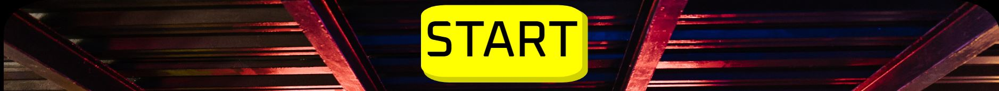

# GamerZone
Thsi website is dedicated quiz page for those interested in gaming trivia and want to learn some new and obscure trivia in a fun enviroment with a retro arcade vibe that potrays a fresh young look as well as catering to the nostalgia seekers.

## Features
This website features an easy navigation format to indicate where users need to click and begin the quiz experience and navigate back to the home page.
The quiz features large contrasted previous and next buttons to help users know what to press as well as making the website more accessible for those with eyesight impairments.

## Wireframe 

**Existing Features**
 **Navigation Bar**
  
  - Navigation bar on all pages, high contrast font for easy reading
  - the nav link brings user back to home if they feel like restarting quiz part way. 
  - I kept the navigation bar simple to keep with the styling of older games, black with white contrast font seemed to be the best fit here.

  

  **Main page text**
  - The text "READY PLAYER ONE?" was a stylistic choice to mimic a arcade game start up screen.
  - the text was put above the START button to further show the user what needs to be clicked/pressed. 

   **Start Button to begin quiz**
 - The design of the start button was to mimic the feeling of an arcade start button.
 - it was designed to look 3D to give the user clear intent that this needs to be pressed.

  

 **Main page image**
  - The image chosen fit very well with the page intent.
  - The colourful image conveys what the user should be expecting from the page, the user will be expecting a game as image helps the feeling of the overall page.

 

 **Footer, copyright text** 
  - The footer consists of high contrast colours, white against black for a sleek vibe yet still in sync with the websites theme.
  - I kept the footer simple for the same reason the navigation bar was styled simplistically.
  - the simple design keeps the user focused on the image and start button (which commenses the quiz).

   

**Quiz**
  - The quiz is compiled of trivia questions based on popular games.
  - There is 10 questions in total to give variety to the user.
  - The aim of the quiz is to be both fun and challenging to the user.
  - there are previous and next buttons to move through the quiz and an end button which acts as both a submit button and link to direct the user back to the hompage.
  - A JavaScript alert appears at the end to indicate total player score.

  

**Quiz box** 
  - The light opacity grey was chosen because I wanted to have the background slightly visable, I felt a stark grey contrast against the background image would ruin flow.
  - The Question font colour is different from answers because I wanted to have a subtle yes noticeable difference between them, that is why questions are a larger font and slightly blue in colour.
 

 

 **The end of quiz button prompt** 
   - I decide to have an end button replacing the next button when the user reached the end of the quiz.
    - The end button will bring the user back to the hompage
   - This was done as to not cause an abrupt stop to the user experience and keep flow in tact.
  
   

   **Score Counter**
   - Score counter was added to give user information of how many correct answers they clicked.
   - The bright green was chosen to make the score box pop against the background and to convey positivity with its bright colour.

   

   **Javascript alert pop up at end of quiz**
   - A alert was added to indicate the final score to the player when they press the end button prompt.

   

  **Features left to add**
    - Create an original song to add to the quiz page for user to play as they go through the quiz.
    - More questions involving a wide variety of games.
    - Either a carousel or a list of corresponding images that match question context and change when next button is clicked.
    - To go through more Media queries to make the website even more accessible to a wider variety of users.

 ## Testing
- Issues faced
    - As seen in the image below, the functionality buttons (next and previous) were getting trapped or stuck behind the question pages.
    This was resolved by using an absolute position and shifting the funtionality buttons down and away from the question container.

    - Another issue faced was the start button to begin the quiz seemed to be moving towards the top of the screen depending on the aspect ratio of the device. 
    This was resolved through CSS and media queries to ensure the start buttons proper placement in designated devices. 

- JavaScript issues
    - The largest issue faced was the intital attempt to run the quiz. The first set of code became saturated with both variables and funtions. 
    Another issue that I faced in the first attempt was the temporal dead zone, as I did not fully understand it at the time so my funtions and variables faced issues communicating.
    - In the second attempt of JavaScript I used a website mentioned below in credits, this resource helped me to keep my funtions and variables consistant and in a clear order for readability.
    - Upon completing the base structure, the questions were listed and funtioned well, at this point I began to add the pages system that allowed me to display one question at a time, issues faced from this initially seemed to break the original code but after a while of revising the code I realised that my initiation function (start game) was incorrect. 
    - The penultimate issue faced was the score counter as I had originally written the code to produce a result once the quiz was finished. The issue came as I had defined all the variables in a previous function and when trying to output the result I was receiving an error of "undefined", to fix this I simply moved any needed variable to the new results function. 
    - The final issue faced was the coding of the alert box to tell the user their results.
    This issue was due, again, to variables being defined within functions, this led to some variables being underdefined which I redefined outside of the function in order to get this work.

- Deployment Issues
    - Issues I had faced after deployment of website was that all hyperlinks were broken and giving a 404 message.
    Through slack and very helpful individuals in my course I finally spotted the issue which was a foward slash on my hyperlinks causing the 404 error. I removed them and pushed the website which solved the issue.

- User testing
    - through a personal group-chat I sent the deployed website to friends and family and received feedback from various devices.
    - I had them play the quiz to ensure functionality. 
    - The participants also sent screenshots followed by their device make and model to allow me to increase my media query scope.

- Summary
    - In relation to testing the feedback provided from the participants was extremely useful in the development of the media queries and the pages overall funtionality. 

the resolutions I have tested the website on are as follows 
- Desktop screen
    - 1024px & up width
- Laptop
    - 769px-1024px width
- Tablet
    - 481px-768px width
- Mobile 
    - 320px-480px width 

### Validator Testing 
- HTML
  - No error found when ran through W3C validator https://validator.w3.org/

-Game.HTML
    - No error found when ran through W3C validator https://validator.w3.org/

- CSS 
  - No errors found when tested on Jigsaw https://jigsaw.w3.org/css-validator/

  

- JavaScript 
    - No errors found when tested on JSHint https://jshint.com/

  ## Deployment 

- My site was deployed through GitHub pages, my methodology was:
  - I went to the project GitHub respository 
  - Clicked on the settings tab
  - went to pages section
  - From the drop down menu I selected the master branch 
  - I then clicked Save
  - I was then given a message on screen to inform me my project has been deployed.

  The live link to my webiste can be found here - https://diabekki.github.io/GamerZone/index.html

  ## Credits

- https://www.sitepoint.com/ 
    - What was used from this site was a guide on the structural layout of JavaScript, e.g fuctions, variables, etc.
- https://favicon.io/
    - This site was used to get the favicon.ico image for the website
- Fonts used throughout website was taken from Google Fonts https://fonts.google.com/

## Media 
- Image media was taken from
   - Pexels https://www.pexels.com/
   - Unsplash https://unsplash.com/

## Acknowledgements

I want to thank my Fiance who kept pushing me to keep bettering myself and not letting me give up and for giving me advice on how get the readme to sound more structured and professional.
Fellow students for letting me vent frustrations when I felt overwhelmed with the work.
Kasia who keeps up our morale and always checks to see if we are doing okay and finally my mentor for guiding me pushing me to do more challeging work.

